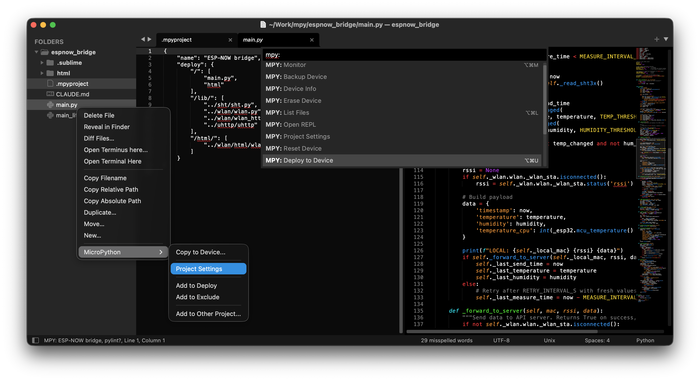

# MpyTool - Sublime Text Plugin

Sublime Text 4 plugin for MicroPython development.

Seamlessly upload and run MicroPython code on your microcontroller directly from Sublime Text. No more switching between editor and terminal.



## Why MpyTool?

- **One-click deploy** - Write code, hit a shortcut, see it running on device
- **Instant feedback** - Monitor serial output without leaving the editor
- **Project-based workflow** - Configure once, deploy anywhere
- **Multiple devices** - Switch between boards effortlessly

## Features

- **Auto-detection** - Finds `.mpyproject` from current file upward
- **Manual selection** - Switch between multiple projects
- **Port selection** - Prompts when multiple devices connected
- **Status bar** - Shows active project name
- **Backup/Restore** - Save and restore device filesystem
- **Terminus integration** - REPL inside Sublime Text (falls back to external terminal)

## Quick Start

1. Install [mpytool](https://github.com/pavelrevak/mpytool) CLI: `pip install mpytool`
2. Open Command Palette (`Cmd+Shift+P` / `Ctrl+Shift+P`)
3. Run `MPY: New Project...` to create `.mpyproject` in your project root
4. Use `MPY: Deploy to Device` (`Cmd+Option+U`) to upload and run

## Installation

### Package Control (recommended)

1. Open Command Palette
2. Run `Package Control: Install Package`
3. Search for `mpytool`

### Manual

Clone or download to Sublime Text Packages directory:

```bash
# macOS
cd ~/Library/Application\ Support/Sublime\ Text/Packages
git clone https://github.com/pavelrevak/mpytool-sublime.git mpytool

# Linux
cd ~/.config/sublime-text/Packages
git clone https://github.com/pavelrevak/mpytool-sublime.git mpytool
```

## Commands

All commands available via Command Palette (`Cmd+Shift+P`) with `MPY:` prefix.

| Command | Description |
|---------|-------------|
| **Deploy to Device** | Upload files + reset + monitor output |
| **Sync to Device** | Upload files + reset (no monitor) |
| **Monitor** | Watch serial output |
| **Open REPL** | Interactive Python console |
| **Reset Device** | Soft reset |
| **List Files** | Show file tree on device |
| **Device Info** | Show device information |
| **Backup Device** | Download all files to `.backup/` |
| **Restore Backup** | Upload `.backup/` to device |
| **Erase Device** | Remove all files from device |
| **New Project...** | Create `.mpyproject` file |
| **Project Settings** | Open `.mpyproject` for editing |
| **Select Project...** | Choose active project |
| **Stop** | Stop running process |

## Keyboard Shortcuts

| macOS | Windows/Linux | Command |
|-------|---------------|---------|
| `Cmd+Option+U` | `Ctrl+Alt+U` | Deploy to Device |
| `Cmd+Option+L` | `Ctrl+Alt+L` | List Files |
| `Cmd+Option+M` | `Ctrl+Alt+M` | Monitor |

## Sidebar Menu

Right-click on files/folders → **MicroPython**:

- **New Project...** - Create new project here
- **Project Settings** - Open project configuration
- **Set as Active Project** - Set this project as active
- **Copy to Device...** - Upload file or folder
- **Add to Deploy** - Add to deploy configuration
- **Add to Exclude** - Add to exclude list
- **Add to Other Project...** - Add to another project's deploy

## Configuration

### .mpyproject

Create `.mpyproject` in your project root:

```json
{
    "name": "my-project",
    "port": "auto",
    "deploy": {
        "/": ["./"]
    },
    "exclude": ["__pycache__", "*.pyc", ".backup"]
}
```

| Field | Description |
|-------|-------------|
| `name` | Project name (shown in status bar) |
| `port` | Serial port or `"auto"` for auto-detection |
| `deploy` | Map of device paths → local sources |
| `exclude` | Patterns to exclude from upload |

### Deploy Examples

```json
// Upload entire project to device root
"deploy": {
    "/": ["./"]
}

// Upload specific files to specific locations
"deploy": {
    "/": ["main.py", "boot.py"],
    "/lib/": ["lib/", "../shared/utils.py"]
}

// Upload external library
"deploy": {
    "/": ["./"],
    "/lib/": ["../external-lib/"]
}
```

### Plugin Settings

`Preferences → Package Settings → mpytool → Settings`:

```json
{
    "mpytool_path": "mpytool"
}
```

## Requirements

- Sublime Text 4 (build 4065+)
- [mpytool](https://github.com/pavelrevak/mpytool) CLI
- Optional: [Terminus](https://packagecontrol.io/packages/Terminus) for in-editor REPL

## License

MIT
